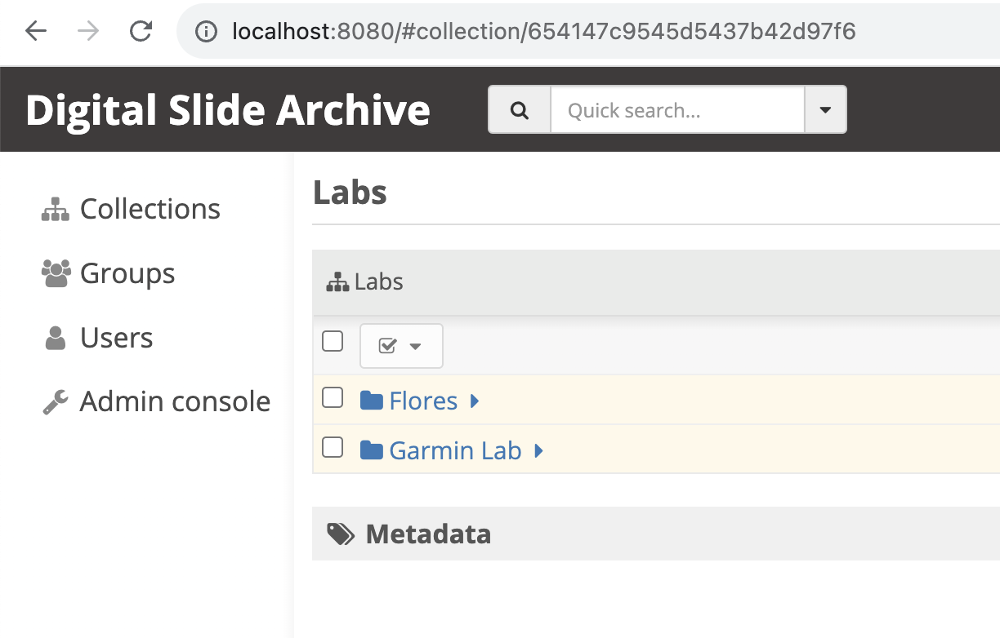

# DSA Structure Management Service

DSA Service for folder and files synchronization with DSA.

# Versions

Node 16+
Docker

# How to run the service:

You'll need to fill the `.env` file (in the root) with the following structure:

```
DSA_HOST=
DSA_USERNAME=
DSA_PASSWORD=
DSA_BASE_COLLECTION_ID=
DSA_FOLDER_NAME=
```

<em> The **`DSA_BASE_COLLECTION_ID`** is the base collection ID where the service is going to synchronize, you can find the ID in the URL.</em>



<em>The **`DSA_FOLDER_NAME`** is the name of the folder where the service is going to search for folders and files to synchronize, The default value is `lcdr`, if you want to change this value, you'll need to put this in the `docker-compose-prod.yml` in the volumes, line 12 </em>

Then run:

```bash
npm install
npm run start:dev
```

# For deployment

Run the following command:
```bash
docker compose -f docker-compose-prod.yml up --build -d
docker-compose -f docker-compose-prod.yml up --build -d
```

# Automated Image Upload Service to DSA

This service automates the upload of images to DSA from a folder. It is designed for uploading large batches of images while maintaining folder structure, particularly for TMA (Tissue MicroArray) files, ensuring compatibility with the Girder plugin for visualizing the TMA grid.

## TMA Folder Structure Example:

```plaintext
test-lab              # Base folder
  ├── ME-BrCa-TMA-1   # TMA folder
  │     ├── tma-structure.xlsx     # Excel file defining the TMA structure
  │     ├── TCGA-CS-4938-STAIN-1   # Stain folder
  │     │     ├── stain.xlsx       # Correlation configuration between study_core_id and image
  │     │     ├── TMA475_1_2_a_.tiff   # Stain images
```

### Key Files:

- **tma-structure.xlsx**: Defines the TMA design. It contains necessary properties such as:

  - `study_core_id`
  - `core_id`
  - `core_label`
  - `tma_number`
  - `row_index`
  - `row_label`
  - `col_index`
  - `col_label`
  - `is_empty`

  Any additional properties found in the file will be considered as `core_annotations`, which will store extra data. Here is an example of a core entry:

  ```json
  {
    "study_core_id": "T01.R02.C10",
    "core_id": 53,
    "core_label": "53",
    "tma_number": 1,
    "row_index": 4,
    "row_label": "D",
    "col_index": 1,
    "col_label": 1,
    "is_empty": false,
    "core_annotations": {
      "tissue": "Breast",
      "Race": "WHITE",
      "Ethnicity_Detail": "PUERTO RICAN",
      "Ethnicity_Broad": "Hispanic",
      "Saavedra Category": "C-H/L",
      "Clinical ER": "Positive",
      "Clinical PR": "Positive",
      "Clinical HER2 IHC": "Negative",
      "label": "IS888888_tumor"
    }
  }
  ```

  This Excel file will be converted to JSON and uploaded to DSA using the API. Every time the file upload process runs, the existing JSON on DSA will be updated with the current values from the `tma-structure.xlsx` file.

- **stain.xlsx**: Contains the correlation configuration between the `study_core_id` (a unique identifier across all cores in a TMA) and the corresponding stain image. This file is also parsed into JSON and uploaded to DSA. An example of the correlation is:
  ```json
  [{ "study_core_id": "T01.R01.C02", "image": "TMA475_1_2_A_.tif" }]
  ```

### Notes:

- Multiple stain folders can exist within the same TMA.
- Each TMA must have its own `tma-structure.xlsx` file.
- Each stain folder must have its own `stain.xlsx` file.
- The service runs on a cron schedule, checking for new files or directories to upload to DSA at intervals (daily or multiple times per day, depending on the configuration). It also updates existing `xlsx` files. **Note**: DSA will always be the source of truth. If files or folders are removed from the base folder, they will not be deleted from DSA, but new or updated files will be uploaded.
